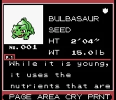
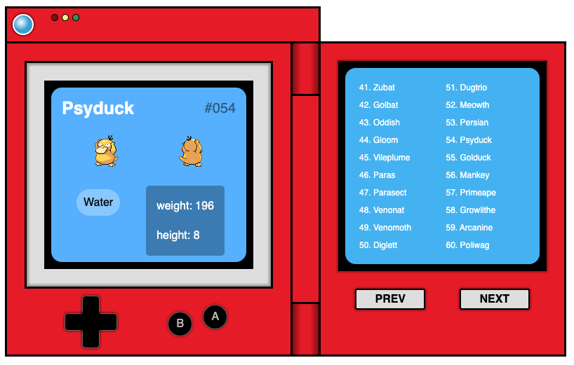
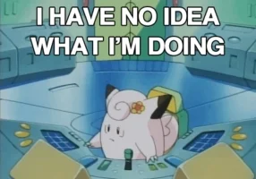

# POKEDEX-CLONE

_Esta practica se trata de maquetar un diseño de un pokedex y hacer uso de JavaScript para consumir la API de pokemon, con los conocimientos vistos en la semana_

# Pokédex
## Using the PokeApi

### Practicas 📋 

* Maquetacion del sition con HTML. 
* Diseño con CSS para que parezca un pokedex la pagina, puede ser un diseño usando su creatividad. 
* Estilos con CSS, lo mas cercano posible, pueden usarse otras imagenes, iconos o colores, pero lo mas cercano posible. 
* Tener un iput de entrada, donde se meta el nombre del pokemon a buscar.
* Tomar ese input e ir a consultar el API de pokeapi, mostrar en pantalla los siguientes datos del pokemon ingresado: 
* Nombre  
* Imagen  
* Tipo de Pokemon  
* Estadisticas  
* Movimientos  

Bonus:  
* Que el diseño de la pagina sea responsive. 
* Poder desplegar la pagina.

## Construido con 🛠️

_Para estas practicas se utilizaron los conocimientos vistos en el curso FrontEnd-Mision_

## Wiki 📖

Puedes encontrar mucho más de cómo utilizar este proyecto en nuestra [Wiki](https://github.com/LaunchX-InnovaccionVirtual/FrontEnd-Mision)

## Autores ✒️

_En esta ocacion el proyecto fue realizado de forma independiente_

* **Gualberto Montiel Diaz** - *Trabajo Inicial* - [gumodi35](https://github.com/gumodi35)

## Expresiones de Gratitud 🎁

* Esta practica sirve para conocer el proceso de desarrollo y los requerimientos para realizar una aplicacion web 📢
* Invita una cerveza 🍺 o un café ☕ a alguien del equipo.
* Gracias por fomentar el aprendizaje de tecnologias web 🤓.
---
⌨️ con ❤️ por [gumodi35](https://github.com/gumodi35) 😊